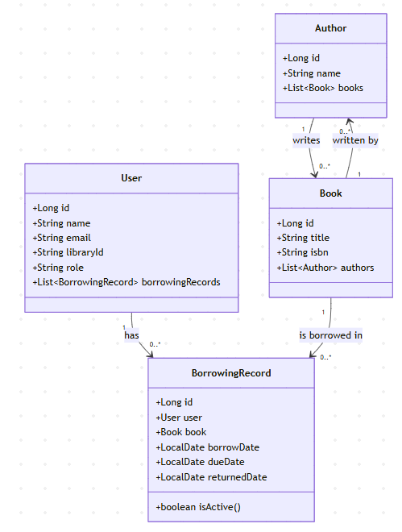
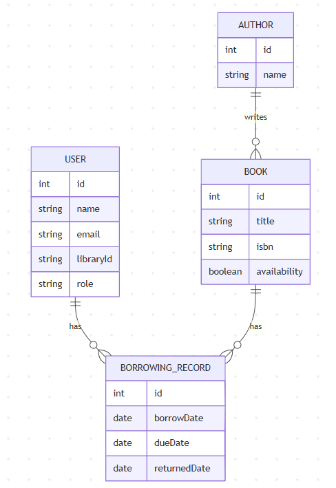

# LibraryManagementSystem-Springboot
RESTful API built with Spring Boot for managing books, authors, users, and borrowing operations. Includes full CRUD functionality, borrowing limits, JWT-based authentication, and persistent storage in a relational database.

## Documentation
- [OpenAPI Specification](MiniLibraryManagementSystem.yaml)
- [Swagger UI](http://localhost:8080/swagger-ui/index.html)
- [API Docs](http://localhost:8080/v3/api-docs)

## Features
- **Book Management**: Add, update, delete, and retrieve books.
- **Author Management**: Manage authors and their biographies.
- **User Management**: Register, update, and delete users.
- **Borrowing Management**: Handle book borrowing and returning processes.
- **Authentication**: Secure endpoints with JWT-based authentication.
- **Role-Based Access Control**: Differentiate access levels for users and admins.
- **Borrowing History**: Track borrowing history for users.
- **Borrowed Books**: Retrieve all books currently borrowed by a user.
- **Borrowing Limits**: Enforce borrowing limits per user.
- **Search Functionality**: Search for books by title, author, or ISBN.
- **API Documentation**: Interactive API documentation using Swagger.
- **Relational Database**: Uses H2 in-memory database for development and testing.
- **Class Diagram**: Visual representation of the system's classes and relationships.
- **Entity Relationship Diagram**: Visual representation of the database schema and relationships.
- **Error Handling**: Consistent error responses for invalid requests.
- **Scheduler Overdue Notifications**: Use Spring Scheduler to notify users of overdue books.
- **Unit Tests**: Basic unit tests for service and controller layers.
- **Postman Collection**: Predefined collection for testing API endpoints.

## Technologies Used
- **Spring Boot**: Framework for building the RESTful API.
- **Spring Data JPA**: For database interactions.
- **H2 Database**: In-memory database for development and testing.
- **JWT**: For secure authentication.
- **Swagger**: For API documentation and testing.

## Getting Started
### Prerequisites
- Java 21
- Gradle

### Quick Start

- Ensure you have Docker installed and running.
// get docker compose on this file and locate on a folder and execute the command docker-compose up:
- Ensure you have Docker Compose installed.
- Download the `docker-compose.yaml` file from the repository:
    - [docker-compose.yaml](docker-compose.yaml)
- Place the `docker-compose.yaml` file in a directory of your choice.
- Open a terminal and navigate to the directory where the `docker-compose.yaml` file is located
- Execute the command `docker-compose up` to start the application.
   ```bash
    docker-compose up
    ```
- The application will be accessible at `http://localhost:8080`.
- You can access the Swagger UI at `http://localhost:8080/swagger-ui/index.html` to explore the API endpoints.
- Postman collection is available for testing the API endpoints.
    - [Postman Collection](LMS.postman_collection.json)

### Installation
1. Clone the repository:
   ```bash
   git clone https://github.com/yourusername/LibraryManagementSystem-Springboot.git
   cd LibraryManagementSystem-Springboot
   ```

2. Build the project:
   ```bash
   ./gradlew build
   ```
3. Run the application:
   ```bash
    ./gradlew bootRun
    ```
    Or using Docker Compose:    
    ```bash
    cd deployment
    docker-compose up
    ```
4. Access the application:
   - Swagger UI: [http://localhost:8080/swagger-ui/index.html](http://localhost:8080/swagger-ui/index.html)
   - API Docs: [http://localhost:8080/v3/api-docs](http://localhost:8080/v3/api-docs) 
5. Sign up a user:
   - Use the `/api/auth/signup` endpoint to register a new user.
   - Example request body:
     ```json
     {
          "username": "testuser",
          "password": "testpass",
          "role": [
              {"name": "USER"}
          ]    
      }
     ```
6. Authenticate the user:
   - Use the `/api/auth/signin` endpoint to log in.
    - Example request body:
      ```json
      {
            "username": "testuser",
            "password": "testpass"
        }
      ```
7. Use the JWT token received from the login response to access protected endpoints.
    Bearer token header example:
    ```http
    Authorization: Bearer your_jwt_token_here
    ```


### Endpoints
  - `GET /api/books`: Get all books
  - `GET /api/books/{id}`: Get a book details by ID
  - `POST /api/books`: Add a new book
  - `GET /api/books/search`: Search for books
    - Query parameters:
      - `query`: Search by book title, author name, or ISBN number
  - `GET /api/users/{id}`: Get user details by ID  
  - `POST /api/borrowings/{userId}/borrow/{bookId}`: Borrow a book
  - `POST /api/borrowings/{userId}/return/{bookId}`: Return a borrowed book
  - `GET /api/borrowings/{userId}/books`: Get all borrowed books by user ID  
  - `GET /api/borrowings/{userId}/history`: Get borrowing history by user ID

## Class Diagram:



## Diagram Relational Database:



